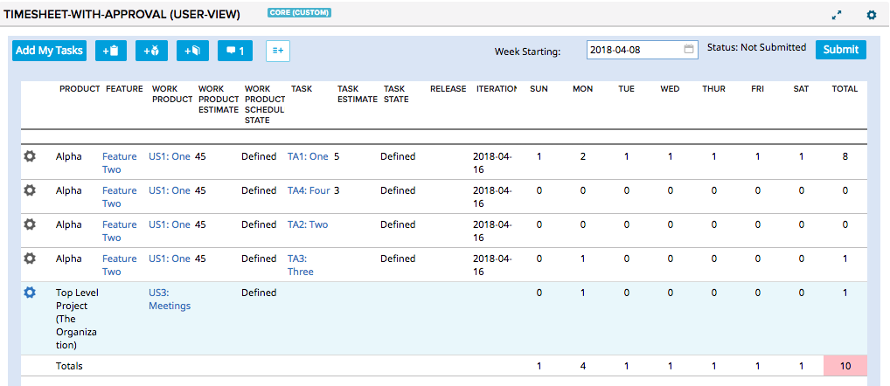
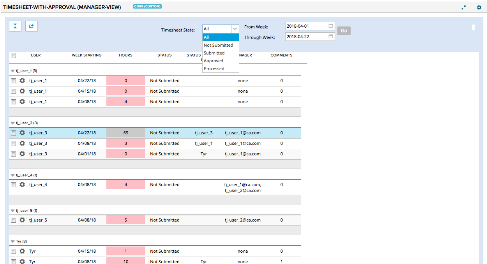

# Timesheet with Approval

A collection of timesheet management applications including:
* `admin-view` - __(1.x only)__ description TBD
* `audit-view` - __(1.x only)__ description TBD
* `common` - Utilities shared by two or more of the apps
* `finance-view` - __(1.x only)__ description TBD
* `manager-view` - Managers can 'approve' or commend on user timesheets. See [README](./manager-view/README.md)
* `user-view` - Similar to the built-in timesheet application. Normal users enter time spent information for stories and tasks.
See [README](./user-view/README.md)

## User View

## Manager View

## Key Features
* Start day of week is configurable
* User can add user stories, tasks and defects and input times for each.
* User stories, tasks and defects can be set as `default` per-user to allow common items to be easily
added to new timesheets.
* User's can submit timesheets for management review.
* A user `manager(s)` is configurable by an app setting that indicates which field on the User object contains
a comma-separated list of manager user names. Only these managers (or admins) will be allowed to see
a that user's timesheets.
* Managers see a summary of all users, and their hour totals per-week.
* Managers can approve, unapprove or comment on user timesheets.

## Limitations
* **Manager edit of user timesheets is explicitly not tested or supported.**

## Versions
* `1.x` branch- The original `r-timesheet-extended` set of applications. On April 12, 2018, this was moved into its own branch and tagged with `v1.0.0`
to allow access and updates to the original app if necessary.  Any customer using the original application should use this version
unless they would like to upgrade
* `master` branch - Refinements and new features to support new customer requirements.  This is the latest version, but may add (or remove)
features from the 1.x version.

## Setup
* Create a shared "preferences" project (e.g. `Shared Preferences (Used by 'Timesheet With Approval' app)`) where all timesheet users and managers have edit access.
This is used to store timesheet approval information.
* Pick (or create as the sub-admin) a User field that will hold the username of that user's manager.  (e.g. `Middle Name` is a good starting point for testing).
* Create a page for the `user-view` app.
   * Set the app setting `Preference Project` to be shared "preferences" project created above.
   * Share it with all projects that have users that will use it.
* Share the `manager-view` app with all projects
   * Set the app setting `Preference Project` to be shared "preferences" project created above.
   * Set the app setting `User Manager Field` to the User field picked above (e.g. `Middle Name` is good for testing)
   * Share it with all projects that have users that will use it.
* Update each User's `User Manager Field` (e.g. `Middle Name`) to contain the **username** of their manager.

## Use
* As a user, go to the `user-view` app. Select tasks and stories.  If needed, set "overhead" stories as defaults using the Gear icon. Enter time values.
* As a manager, go to the `manager-view` app. Review timesheets from users that have you as a manager. Approve, Unapprove, Comment on user timesheets.
Click on a user timesheet row to view the detailed timesheet.  You can the timesheet summary or detailed timesheet as a CSV file.

## Development Notes
This app supports a day of week start other than Sunday. This adds considerable complication to the code to
work around the fact that in Agile Central, `TimeEntryItem` objects must have a Sunday `WeekStartDate`. The
app does this using several techniques:
* always save and query using UTC times to server for `TimeEntryItem.WeekStartDate` and `TimeEntryValue.DateVAl`
* when a work item is added to a timesheet, use 2 `TimeEntryItem` objects to hold the timesheet data. One for
each Sunday-based week that contains some of the days of the non-Sunday week timesheet.
* when a work item is removed, clear the `TimeEntryValue` but don't remove the `TimeEntryItem`. This is because
a given `TimeEntryItem` may span multiple non-Sunday timesheets and cannot be removed unless the work item is
removed from both timesheets. For simplicity, simply leave the `TimeEntryItem` with no `TimeEntryValue` for
work items removed from a timesheet.
